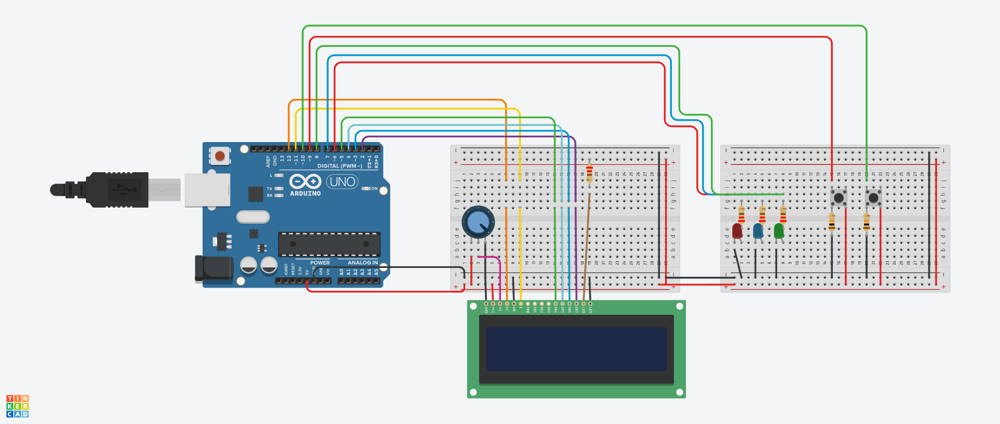

<!-- _class: invert -->

# Steuerungs- und Regelungskompetenz <!-- fit -->

## präsentiert von Stanislau und Joel

---

# Agenda

- Tinkercad
- Projekt: Counter
- Quellcode

---

# Tinkercad

- Webapplikation für 3D-Design, Elektronik und Programmierung
- In unserem Fall verwendet für Schaltkreise
- Virtuelle Komponenten

---

# Tinkercad

## Vorteile

- Keine Materialkosten
- Einfache Verkabelung (kein Löten, Kabel isolieren, etc.)
- Möglichkeit zur Kollaboration

## Nachteile

- Begrentze Anzahl an Komponenten
- Weniger Leistung
- Unübersichtlicher

---

# Counter

- Virtuell umgesetzt
- Hoch- und Hinunterzählen
- Aktueller Wert wird auf einem LCD Display angezeigt
- LED's geben über Zahlenbereich bescheid (positiv, null, negativ)

---

# Counter

## Komponenten

- Arduino UNO
- 16x2 LCD Display
- 3 x LED's (Rot, Blau, Grün)
- 2 x Knöpfe
- Potentiometer
- 220 Ω Wiederstand
- 5 x 10k Ω Wiederstände

---

# Counter

## Übersicht



---

# Quellcode

# Imports


```cpp
#include <LiquidCrystal.h>
```

---

# Quellcode


```cpp
#define LED_GREEN 6
#define LED_BLUE 7
#define LED_RED 8
#define BUTTON_INCREASE 9
#define BUTTON_DECREASE 10
```

---

# Quellcode

```cpp
void setup()
{
    pinMode(LED_GREEN, OUTPUT);
    pinMode(LED_BLUE, OUTPUT);
    pinMode(LED_RED, OUTPUT);
    pinMode(BUTTON_INCREASE, INPUT);
    pinMode(BUTTON_DECREASE, INPUT);
    lcd.begin(16, 2);
    updateScreen();
}
```

---

# Quellcode

```cpp
void updateScreen()
{
    lcd.clear();
    lcd.print("Counter:");
    lcd.setCursor(0, 1);
    lcd.print(count);
}
```

---

# Quellcode

```cpp
void loop() {
    checkButtons();
}
```

---

# Quellcode

```cpp
void checkButtons() {
    if (digitalRead(BUTTON_INCREASE))
    {
        count++;
        updateVisuals();
        delay(500);
    }
    if (digitalRead(BUTTON_DECREASE))
    {
        count--;
        updateVisuals();
        delay(500);
    }
}
```

---

# Quellcode

```cpp
void updateVisuals()
{
    updateScreen();
    updateLEDs();
}
```

---

# Quellcode

```cpp
void updateLEDs()
{
    if (count > 0)
    {
        digitalWrite(LED_RED, HIGH);
    }
    else
    {
        digitalWrite(LED_RED, LOW);
    }
    if (count == 0)
    {
        digitalWrite(LED_BLUE, HIGH);
    }
    else
    {
        digitalWrite(LED_BLUE, LOW);
    }
    if (count < 0)
    {
        digitalWrite(LED_GREEN, HIGH);
    }
    else
    {
        digitalWrite(LED_GREEN, LOW);
    }
}
```

---

# Kahoot

---

<!-- _class: invert -->

# Schluss

## Vielen Dank für eure Aufmerksamkeit!

---

# Repository mit Quellcode und Präsentation


